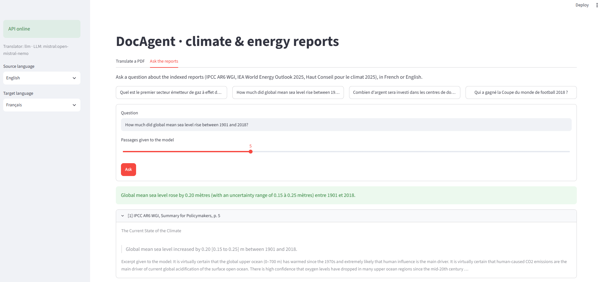

# DocAgent

Work with climate and energy reports (IPCC, IEA, French High Council on Climate) in two ways:

- **Translate** a PDF **without breaking its layout**: charts, colours, columns, footnotes and styles stay where they were. The PDF is split into text blocks, translated page by page by an LLM with validated JSON output, and each block is rewritten in place.
- **Ask the reports** a question in French or English and get an answer **with its sources**: report, page, and the sentence that proves it, checked by code before the answer is shown. When the reports do not say it, DocAgent says so instead of guessing.

Next step: a LangGraph agent that combines translation and search on the same corpus.


**Status:** v0.2, translator + question answering (RAG). Agent in progress (see [Roadmap](#roadmap)).

## What it does

**Translation**

- **Keeps the layout**: text is erased and rewritten in place; images, charts and backgrounds are untouched. Text grows into free space before its font is reduced, one-line headings stay on one line, paragraphs keep their spacing.
- **Keeps inline styles**: colour, bold, italic, superscript and subscript runs survive translation (footnote calls, CO₂, *likely*).
- **Uses the official terminology**: a glossary built from the official French IPCC summary (SPM → RID, *high confidence* → *degré de confiance élevé*); codes and acronyms (MED, CO2, SSP1-2.6) are never sent to the model.
- **Checks its own output**: after each translation, automatic checks that graphics survived, no source text is left, every number is still in place, no text overlaps, no zone is empty and no tag is printed as text.
- **Detects the source language** from the PDF metadata or its text.

**Questions on the reports (RAG)**

- **Hybrid search**: dense retrieval (multilingual embeddings, in Qdrant) for meaning and across languages, BM25 for exact words, codes and figures, fused with Reciprocal Rank Fusion. Every passage keeps its report and page.
- **Answers that can be checked**: the model answers only from the passages it is given and must copy, for each fact, the sentence that states it. The code verifies that the sentence is in the cited passage (words in order, figures exact) and that every figure of the answer appears in the cited passages. Otherwise, the answer is not shown.
- **Refuses when the reports do not answer**: off-topic and near-topic questions get "not found" rather than a plausible guess.
- **Measured**: retrieval and answers are evaluated on question sets with known answer pages, including a test set kept aside (see [Results](#results)).

**Both**

- **Any OpenAI-compatible LLM**: Mistral, Groq, OpenRouter or a local Ollama model, chosen in `.env`.
- **API + web front end + Docker**: FastAPI (asynchronous translation jobs, `/v1/ask`), a Streamlit front end with a side-by-side preview and an "Ask the reports" tab, Qdrant as a service; `docker compose up` runs the whole demo.

## Results

### Translation

IPCC AR6 WGI Summary for Policymakers, English → French, 8 pages, `open-mistral-nemo` (Mistral free tier):

| Measure | Value |
| --- | --- |
| Text zones rewritten | 307 |
| Mean font size | 90% of the original |
| Zones that did not fit | 0 |
| Automatic checks | all passed |
| LLM requests | 13 (1 retry) |
| Blocks handled without the model (codes, glossary) | 132 |
| Time | 2 to 4 min (rate-limited free tier) |

Translation quality (COMET, chrF against the official IPCC French version) will be measured in phase 6.

### Questions on the reports

Corpus: 5 public reports, about 1,000 pages, 4,970 passages (IPCC AR6 WGI SPM in English and French, IEA World Energy Outlook 2025 and its French summary, HCC annual report 2025). Answers by `open-mistral-nemo`, 5 passages per question.

**Test set kept aside** (15 questions with an answer, 4 without; written after all tuning, measured once):

| Measure | Value |
| --- | --- |
| Right page in the top 5: dense e5 / hybrid / BM25 | 93% / 87% / 73% |
| Answered, citing the right page | 12 / 15 |
| **Wrong answers shown** | **0** |
| Questions without an answer in the reports, refused | 4 / 4 |

The 3 questions not answered were refusals: two whose page the search missed (both cross-lingual, the weak spot of BM25) and one rejected by an over-strict check, since fixed.

**What the development set taught** (24 + 6 questions, used to build the system, scores optimistic):

| Choice | Measured |
| --- | --- |
| Embedding model | `multilingual-e5-base` (local) beats `mistral-embed` (API): 92% vs 67% of right pages in the top 5; paired sign test on the rank, p = 0.01 |
| Fusion | Hybrid helps only with a good dense model: with `mistral-embed` it lost pages BM25 had found |
| Checking the answers | Without checks, 2 wrong answers out of 24 (an invented ranking, a figure from the wrong passage); with verified quotes and figures, 0 |
| A prompt change | "Translate units" turned 15.6 Mt into "15.6 billion tonnes": reverted, units are now copied |

Every run is in [evals/rag_results.md](evals/rag_results.md), every answer in [evals/answers/](evals/answers/), and the reasoning in [DECISIONS.md](DECISIONS.md).

## Quickstart with Docker

```bash
git clone https://github.com/lylyamm/docagent.git
cd docagent

# Layout demo, no API key needed (the "translation" is the text in upper case, 20% longer):
TRANSLATOR=fake docker compose up --build

# Real translation: choose a provider and put its key in .env
cp .env.example .env
docker compose up --build
```

Front end: http://localhost:8501 · API docs: http://localhost:8000/docs · Qdrant dashboard: http://localhost:6333/dashboard

Three services: `api` (FastAPI, with the `multilingual-e5-base` model baked into the image, CPU only), `front` (Streamlit) and `qdrant` (vector database).

**Questions on the reports** need the search index. Download the 5 reports listed in [data/corpus.json](data/corpus.json) into `data/raw/`, then build it once inside Docker (about 45 min on a laptop CPU, nothing leaves the machine):

```bash
docker compose --profile index run --rm indexer   # passages in data/index/, vectors in qdrant
docker compose up                                 # then the "Ask the reports" tab
```

Already built an index locally (see below)? Copy its vectors instead, in a few seconds:

```bash
docker compose up -d qdrant
uv run python scripts/rag_copy_vectors.py
docker compose up
```




On Windows PowerShell, the first command is `$env:TRANSLATOR="fake"; docker compose up --build`.

## Local development

Requires [uv](https://docs.astral.sh/uv/).

```bash
uv sync
uv run pytest                                                  # 164 tests, no network, no key

uv run python scripts/rebuild.py                               # fake translation of every sample + checks
uv run python scripts/translate.py data/samples/giec_spm_en.pdf --pages 1 2   # real LLM translation

uv run uvicorn docagent.api.app:serve --factory --reload       # API on http://localhost:8000/docs
uv run --group front streamlit run front/app.py                # front end on http://localhost:8501
```

Outputs (translated PDFs, side-by-side comparisons, debug PDFs) go to `data/output/`.

### Questions on the reports

1. Download the 5 reports listed in [data/corpus.json](data/corpus.json) (public links) into `data/raw/`.
2. Build the index, once (about 45 min on a laptop CPU with the local model; nothing leaves the machine):

```bash
uv sync --extra local                                          # sentence-transformers for the local model
uv run python scripts/rag_index.py --embedder e5               # passages + vectors in data/index/
```

3. Put `EMBEDDER=e5` in `.env`, then:

```bash
uv run python scripts/rag_ask.py "Quel est le premier secteur émetteur de gaz à effet de serre en France en 2024 ?"
uv run python scripts/rag_search.py "carbon budget 1.5°C" --mode hybrid   # search only, no LLM

uv run python scripts/rag_eval.py --embedder e5 mistral        # retrieval: hit@k, MRR, paired tests
uv run python scripts/rag_eval_answers.py                      # answers: cited the right page, refusals
```

Locally the vector store runs embedded (a folder, no server): one program at a time can open it, so stop the API before running the scripts. In Docker it is the `qdrant` service, which has no such limit.

## API

| Method | Path | |
|---|---|---|
| `POST` | `/v1/detect` | multipart `file` (PDF) → its language, from the PDF metadata or its text |
| `POST` | `/v1/translate` | multipart `file` (PDF), `source_lang` (`auto` by default), `target_lang` → `202 {job_id}` |
| `GET` | `/v1/jobs/{job_id}` | status (`queued`, `running`, `done`, `failed`), page progress, summary |
| `GET` | `/v1/jobs/{job_id}/download` | translated PDF |
| `POST` | `/v1/ask` | JSON `{"question": ..., "top_k": 5}` → answer, sources (report, page, verified quotes), timings |
| `GET` | `/health` | liveness and configured LLM |

## How it works

**Translation**

1. **Extract** (`src/docagent/pdf/extract.py`): PyMuPDF gives blocks → lines → spans → characters. Blocks are the translation unit; runs whose style differs from the block's become tags (`<s1>…</s1>`). Bullets and footnote numbers are cut out and kept in place; numbers, formulas and vertical text are not translated.
2. **Translate** (`src/docagent/translate/`): one request per page, JSON in and out, validated with Pydantic; retries with exponential backoff; blocks the model skipped are asked again alone; broken style tags are repaired locally when possible; results are cached on disk.
3. **Rebuild** (`src/docagent/pdf/rebuild.py`): redactions erase the text only; `insert_htmlbox` rewrites it in the original font when it has the glyphs, in a box grown into free space, shrinking the font only as needed (same scale for blocks of the same style).
4. **Verify** (`src/docagent/pdf/verify.py`): automatic checks on the output (see *What it does*).

**Questions** (`src/docagent/rag/`)

```
question ──► embed (e5) ──► Qdrant: 20 nearest passages ──┐
         └─► BM25: 20 best passages ──────────────────────┴─► RRF ─► 5 passages, numbered [1]..[5]
                                                                         │
             LLM: answer only from these, cite [n], copy the sentence ◄──┘
                                                                         │
             code: quote really in passage n? figures in the cited passages? ──► answer or "not found"
```

5. **Passages** (`chunking.py`): built from the extracted blocks, so every passage has a page; about 1,000 characters with overlap, cut at headings, prefixed with the report title and section; running headers, tables of contents and footnote placement handled.
6. **Search** (`bm25.py`, `embeddings.py`, `store.py`, `fusion.py`, `search.py`): BM25 written by hand to keep codes and figures whole ("SSP1-2.6", "1,5"); embeddings from a local model or an API, one Qdrant collection per model; Reciprocal Rank Fusion of the two rankings.
7. **Answer** (`answer.py`): numbered passages, JSON answer with evidence, verification in code, and the reasons of each refusal kept for evaluation.
8. **Evaluate** (`evaluation.py`, `scripts/rag_eval*.py`): hit@k and MRR for the search, paired tests (McNemar, sign test) to compare two systems on the same questions, answer-level metrics, and a test set kept aside ([evals/README.md](evals/README.md)).

Every design choice, with what was measured and what was rejected, is in [DECISIONS.md](DECISIONS.md).

## Limitations

- Vertical text (rotated axis labels) is not translated yet.
- Embedded fonts are subsets without accented letters, so French text often falls back to a generic, wider font: the main reason text is shrunk.
- LaTeX formulas and drop caps in scientific papers still cause a few overlaps.
- Scanned PDFs (images without text) need OCR, not supported.
- A small free model makes occasional translation mistakes; larger models will be compared in phase 6.
- Questions: the evaluation sets are small (24 and 15 questions), so differences of one or two questions are not significant. Cross-lingual search relies on the dense model alone, since BM25 needs shared words. The answer checks catch invented quotes and figures, not a true sentence taken from the wrong passage. Indexing with a local model takes about 45 min on a laptop CPU.

## Roadmap

1. ~~**PDF core**: extraction and in-place reconstruction with a fake translation~~
2. ~~**Translator v1**: LLM translation, FastAPI, Docker, web front end~~
3. ~~**RAG**: hybrid search with page-level citations, verified answers, evaluation, Qdrant as a Docker service~~
4. **Agent**: LangGraph agent orchestrating translate / search / answer / verify, with MCP tools (files, fetch)
5. **Industrialization**: CI/CD, cloud deployment, tracing and cost monitoring
6. **Evaluation**: translation benchmark (COMET, chrF) against official IPCC French versions


## Project layout

```
src/docagent/pdf/        # extraction, reconstruction, checks, language detection
src/docagent/translate/  # translators (fake, OpenAI-compatible LLM), cache, glossary, tag repair
src/docagent/rag/        # passages, BM25, embeddings, Qdrant, fusion, search, answers, metrics
src/docagent/chat.py     # small client for JSON answers from the LLM
src/docagent/api/        # FastAPI app: translation jobs, questions
front/app.py             # Streamlit front end (translate, ask)
scripts/                 # translation, indexing, search, question, evaluation and vector copy scripts
tests/                   # pytest suite (no network)
evals/                   # question sets, results, saved answers
data/samples/            # public PDF excerpts (see data/SOURCES.md)
data/corpus.json         # the reports indexed for questions, with their public links
data/glossary_en_fr.json # imposed terminology (official IPCC French)
DECISIONS.md             # design decisions log
```

## Data and license

All documents are public reports; sample excerpts and their sources are listed in [data/SOURCES.md](data/SOURCES.md), the indexed reports in [data/corpus.json](data/corpus.json). Full reports and the search index are not versioned. The code is under the MIT license.
