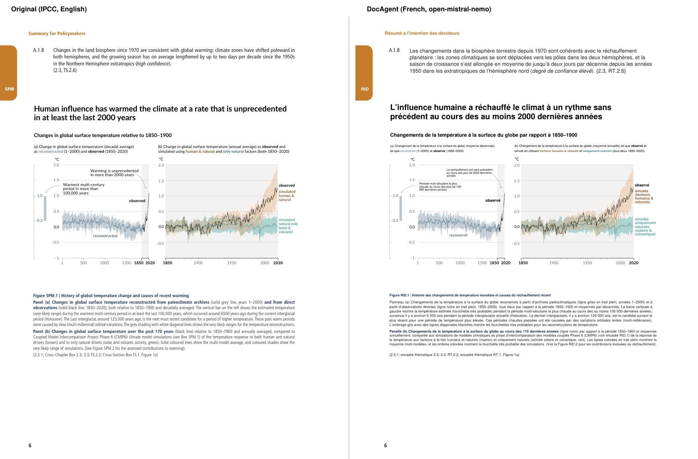
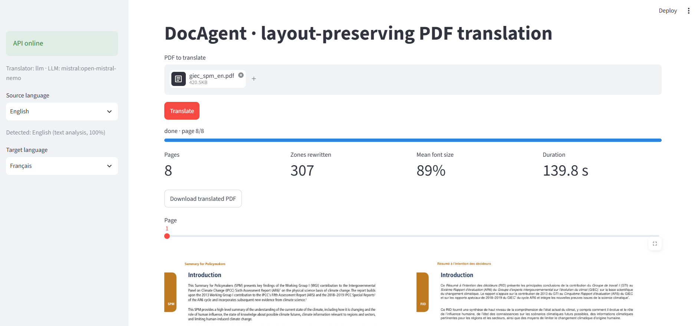

# DocAgent

Translate climate and energy reports (IPCC, IEA, French High Council on Climate) **without breaking their layout**: charts, colours, columns, footnotes and styles stay where they were. The PDF is split into text blocks, translated page by page by an LLM with validated JSON output, and each block is rewritten in place.

Next steps: document search with page-level citations (RAG) and a LangGraph agent on the same corpus.



**Status:** v0.1.0, translator. RAG and agent in progress (see [Roadmap](#roadmap)).

## What it does

- **Keeps the layout**: text is erased and rewritten in place; images, charts and backgrounds are untouched. Text grows into free space before its font is reduced, one-line headings stay on one line, paragraphs keep their spacing.
- **Keeps inline styles**: colour, bold, italic, superscript and subscript runs survive translation (footnote calls, CO₂, *likely*).
- **Uses the official terminology**: a glossary built from the official French IPCC summary (SPM → RID, *high confidence* → *degré de confiance élevé*); codes and acronyms (MED, CO2, SSP1-2.6) are never sent to the model.
- **Works with any OpenAI-compatible LLM**: Mistral, Groq, OpenRouter or a local Ollama model, chosen in `.env`.
- **Checks its own output**: after each translation, automatic checks that graphics survived, no source text is left, every number is still in place, no text overlaps, no zone is empty and no tag is printed as text.
- **Detects the source language** from the PDF metadata or its text.
- **API + web front end + Docker**: asynchronous jobs with FastAPI, a Streamlit front end with side-by-side preview.

## Results

IPCC AR6 WGI Summary for Policymakers, English → French, 8 pages, `open-mistral-nemo` (Mistral free tier):

| Measure | Value |
| --- | --- |
| Text zones rewritten | 307 |
| Mean font size | 90% of the original |
| Zones that did not fit | 0 |
| Automatic checks | all passed |
| LLM requests | 13 (1 retry) |
| Blocks handled without the model (codes, glossary) | 132 |
| Time | 2 to 4 min (rate-limited free tier) |

Translation quality (COMET, chrF against the official IPCC French version) will be measured in phase 6.

## Quickstart with Docker

```bash
git clone https://github.com/lylyamm/docagent.git
cd docagent

# Layout demo, no API key needed (the "translation" is the text in upper case, 20% longer):
TRANSLATOR=fake docker compose up --build

# Real translation: choose a provider and put its key in .env
cp .env.example .env
docker compose up --build
```

Front end: http://localhost:8501 · API docs: http://localhost:8000/docs



On Windows PowerShell, the first command is `$env:TRANSLATOR="fake"; docker compose up --build`.

## Local development

Requires [uv](https://docs.astral.sh/uv/).

```bash
uv sync
uv run pytest                                                  # 131 tests, no network, no key

uv run python scripts/rebuild.py                               # fake translation of every sample + checks
uv run python scripts/translate.py data/samples/giec_spm_en.pdf --pages 1 2   # real LLM translation

uv run uvicorn docagent.api.app:serve --factory --reload       # API on http://localhost:8000/docs
uv run --group front streamlit run front/app.py                # front end on http://localhost:8501
```

Outputs (translated PDFs, side-by-side comparisons, debug PDFs) go to `data/output/`.

## API

| Method | Path | |
|---|---|---|
| `POST` | `/v1/detect` | multipart `file` (PDF) → its language, from the PDF metadata or its text |
| `POST` | `/v1/translate` | multipart `file` (PDF), `source_lang` (`auto` by default), `target_lang` → `202 {job_id}` |
| `GET` | `/v1/jobs/{job_id}` | status (`queued`, `running`, `done`, `failed`), page progress, summary |
| `GET` | `/v1/jobs/{job_id}/download` | translated PDF |
| `GET` | `/health` | liveness and configured LLM |

## How it works

1. **Extract** (`src/docagent/pdf/extract.py`): PyMuPDF gives blocks → lines → spans → characters. Blocks are the translation unit; runs whose style differs from the block's become tags (`<s1>…</s1>`). Bullets and footnote numbers are cut out and kept in place; numbers, formulas and vertical text are not translated.
2. **Translate** (`src/docagent/translate/`): one request per page, JSON in and out, validated with Pydantic; retries with exponential backoff; blocks the model skipped are asked again alone; broken style tags are repaired locally when possible; results are cached on disk.
3. **Rebuild** (`src/docagent/pdf/rebuild.py`): redactions erase the text only; `insert_htmlbox` rewrites it in the original font when it has the glyphs, in a box grown into free space, shrinking the font only as needed (same scale for blocks of the same style).
4. **Verify** (`src/docagent/pdf/verify.py`): automatic checks on the output (see *What it does*).

Every design choice, with what was measured and what was rejected, is in [DECISIONS.md](DECISIONS.md).

## Limitations

- Vertical text (rotated axis labels) is not translated yet.
- Embedded fonts are subsets without accented letters, so French text often falls back to a generic, wider font: the main reason text is shrunk.
- LaTeX formulas and drop caps in scientific papers still cause a few overlaps.
- Scanned PDFs (images without text) need OCR, not supported.
- A small free model makes occasional translation mistakes; larger models will be compared in phase 6.

## Roadmap

1. ~~**PDF core**: extraction and in-place reconstruction with a fake translation~~
2. ~~**Translator v1**: LLM translation, FastAPI, Docker, web front end~~
3. **RAG**: document search with page-level citations
4. **Agent**: LangGraph agent orchestrating translate / search / summarize / compare
5. **Industrialization**: CI/CD, cloud deployment, tracing and cost monitoring
6. **Evaluation**: translation benchmark (COMET, chrF) against official IPCC French versions

## How this project was built

I designed and steered this project, tested it on real reports and reviewed every change; much of the code was written with an AI assistant (Claude). My part: defining what to build, checking the translated PDFs page by page against the originals, finding the defects (fonts, overlaps, lost colours and styles, wrong terminology, missing spacing), deciding the fixes and keeping [DECISIONS.md](DECISIONS.md).

## Project layout

```
src/docagent/pdf/        # extraction, reconstruction, checks, language detection
src/docagent/translate/  # translators (fake, OpenAI-compatible LLM), cache, glossary, tag repair
src/docagent/api/        # FastAPI app: upload, background jobs, download
front/app.py             # Streamlit front end
scripts/                 # exploration, extraction, rebuild and translation scripts
tests/                   # pytest suite (no network)
data/samples/            # public PDF excerpts (see data/SOURCES.md)
data/glossary_en_fr.json # imposed terminology (official IPCC French)
DECISIONS.md             # design decisions log
```

## Data and license

Sample PDFs are short excerpts of public reports; sources and links are listed in [data/SOURCES.md](data/SOURCES.md). The code is under the MIT license.
